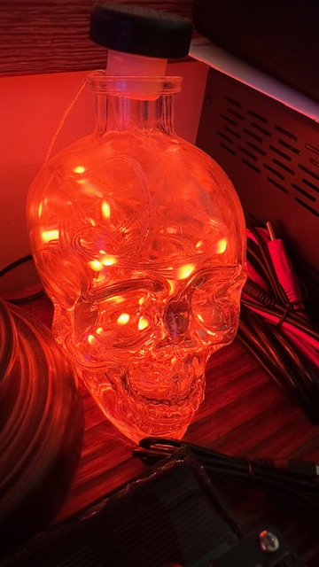

# Homekit Controlled LED String lights
This is a hacked together implementation of a Homekit light. It requires a couple of moving parts, but if you already have the infrastructure, it's an easy way to add some lighting that the whole family can control from their Homekit-capable phones, tablets, etc.
## Requirements
### SW:
- Homebridge install on local network. See https://homebridge.io/ for more info
- Homebridge MQTTThing plugin. This is used to map Homekit commands to MQTT topics. See here for more details: https://github.com/arachnetech/homebridge-mqttthing
- An MQTT broker on local network (I'm using Mosquitto: https://mosquitto.org/download/)

### HW:
- Pimoroni Plasma Stick RP2040 W (https://shop.pimoroni.com/products/plasma-stick-2040-w?variant=40359072301139)
- WS2812 (NeoPixel) LED String (I'm using the one included in this kit: https://shop.pimoroni.com/products/wireless-plasma-kit?variant=40372594704467)

## Setup
My setup for this is based heavily on the setup and hosts I already had in place for other reasons. Yours will likely differ, but here's an overview of how it is running in my house. 

I have Homebridge running on a Raspberry Pi Compute Module 4 that is installed on a [Desk Pi Super6C cluster board](https://deskpi.com/collections/deskpi-super6c/products/deskpi-super6c-raspberry-pi-cm4-cluster-mini-itx-board-6-rpi-cm4-supported) that is located in my garage. I'm using Hombridge for a few different devices, but the main reason originally was to integrate my Ring alarm system with Homekit. I actually have another CM4 installed on the same cluster board running my MQTT broker, although this is really a waste of good computing power. You could easily have the MQTT broker running on the same RPi as Homebridge or on an older or less powerful SBC. Its average sys load is ~2.25% with 7 sensors (CO2 and temperature) and 6 lights going through it. 

Homebridge and the MQTT broker can be setup on a variety of hosts, the only really important part is they stay always on. Low power ARM SBCs are great for this, but anything will work.

From there, you'll need to install and configure the Homebridge-Mgttthing plugin, see the link above for more details on how this works. My config for one of my lights looks like this: 

```json
{
    "type": "lightbulb-RGB",
    "name": "Skull",
    "url": "mqtt://192.168.2.12:1883",
    "logMqtt": true,
    "topics": {
        "getRGB": "Office\\Skull\\getRGB",
        "setRGB": "Office\\Skull\\setRGB",
        "setOn": "Office\\Skull\\setOn",
        "getOn": "Office\\Skull\\getOn"
    },
    "accessory": "mqttthing"
}
```

Stepping through the important parts:
- `"type"` needs to be set to `"lightbulb-RGB"` for my config (and code) to work, see more info here: https://github.com/arachnetech/homebridge-mqttthing/blob/93f81e506c7579f4250c1e0bedcb822a8be517e0/docs/Configuration.md
 - `"url"` should be set to the URL and port of your MQTT broker
 - `"topics"` needs to be populated with the MQTT topics that that will be used to set the RGB values and on/off state, these topics need to be the same as is used in the code. If you are implementing more than one light, each will need their own topics. In my case, I've organized them by room and device, ie. `Office\\Skull` for my skull light shown below.

  

## Code
The code for this is pretty simple. As we are using the Pimoroni variant of MicroPython with their nice example code coming on the Plasma Stick, we will reuse the provided `network_manager.py`. This is used to do the initial connection to wifi as shown below. Pay attention to the note, a frequent problem I had was that when power went out briefly from storms and such, the wifi would take longer to come back than I originally had for a timeout here. I've since extended it to 3mins to give my WiFi time to reboot.

```python
# set up wifi, set timeout to 3 mins to handle power loss (wifi takes a couple of mins to come back online)
# if set to too low a timeout, the device will not connect to wifi on boot
network_manager = NetworkManager(WIFI_CONFIG.COUNTRY, status_handler=status_handler, client_timeout=180)
uasyncio.get_event_loop().run_until_complete(network_manager.client(WIFI_CONFIG.SSID, WIFI_CONFIG.PSK))
```

You may also want to play with the intensity of the light in the status handler code, if your power goes out at night you don't want the room lit up with flashing white lights while it repeatedly tries to connect. The code will flash the LEDs to the color you set and if fails to connect it will turn red for 1 min and then off. In my case, found a nice dim purple worked for me.

The code also saves and loads two sets of RGB values from files stored on the microcontroller with the methods `read_value` and `update_value`. The `lastvalue.txt` file is used to store the last RGB values the lights were set to, and `prevvalue.txt` is used to store the previous value. Previous value is only read and saved in the context of the `setOn` topic. If the lights are turned off, the last value saved is `0, 0. 0`, while the previous value is whatever the lights were set at before being switched off (for example `255, 255, 255` for bright white). This lets the code turn the LEDs back on to the same RGB values they had when switched off. When the device reboots after a power outage, it uses the RGB values stored in the `lastvalue.txt` file. This is for convenience but also to keep it dark when it restarts if it was previously turned off (again, a power failure mitigation).

The main event loop of the software is simple, just looking for MQTT messages. The sleep is kept very low to keep the lights responsive. You can modify to your liking and needs (for example a light that only implements on/off could go with a longer sleep here without losing much performance).

```python
# Main loop
try:
    while True:
        # Check for incoming MQTT messages
        client.check_msg()
        time.sleep(0.005)
finally:
    client.disconnect()
```

If a message comes through the broker on a topic we subscribed to (ie setOn, setRGB and getRGB ...), it will get handled in the `mqtt_callback` function we set when setting up our MQTT client. The code for this is shown below and this is where the main action takes place in response to a user modifying the light in Homekit.

```python
# Function to handle incoming MQTT messages
def mqtt_callback(topic, msg):
    print(f"received {topic} and {msg}")
    global red, green, blue
    if topic.endswith(b"setRGB"):
        # Parse RGB values from the message
        r, g, b = map(int, msg.split(b","))
        # Update the RGB color values
        red, green, blue = r, g, b
        # Control the LED based on the RGB values (assuming you have an RGB LED)
        # Replace 'gpio_red', 'gpio_green', and 'gpio_blue' with the actual GPIO pin numbersif topic.endswith(b"setOn"):
        for i in range(NUM_LEDS):
            led_strip.set_rgb(i, red, green, blue)
        update_value(red, green, blue)
    if topic.endswith(b"setOn"):    
        if msg == b"true":
            print("turning on")
            red, green, blue = read_value(PREV_FILENAME)
            for i in range(NUM_LEDS):
                led_strip.set_rgb(i, red, green, blue)
                time.sleep(0.005)
        else: 
            for i in range(NUM_LEDS):
                led_strip.set_rgb(i, 0, 0, 0)
            update_value(red, green, blue, PREV_FILENAME)
            update_value(0, 0, 0)
        
    elif topic.endswith(b"getRGB"):
        # Respond with the current RGB color
        client.publish(topic, f"{red},{green},{blue}")
```

One other note, we're using the file WIFI_CONFIG.py to store our configuration that will be specific to your lights and setup. You'll need to update this to have the WiFi credentials the device will use, your broker info and the topics (that match what is setup in the Homebridge plugin). The empty version of this config looks like this, you will need to replace the values with what works for your individual setup.

```python
# Description: Configuration file for WIFI connection and MQTT broker
# Update the following variables with your own values that match your network and MQTT broker
SSID = "WIFI_SSID" # e.g. "my_wifi"
PSK = "WIFI_PASSWORD" # e.g. "password"
COUNTRY = "COUNTRY_CODE" # e.g. "US"
BROKER = "BROKER_IP" # e.g. "mqtt://192.168.1.2:1883" (ie. if MQTT broker at that IP and using thr default port)
HOSTNAME = "NETWORK_HOSTNAME" # e.g. "Cabinet2_Strip", this is the hostname that will show up if you look at the list of DHCP clients on your network, can be helpful for troubleshooting
LOCATION = b"LOCATION" # e.g. b"Living\\Cabinet2\\" for MQTT topic, this can be used to group devices

# MQTT topics, note these need to match the topics configured in the MQTTThing plugin configuration
# These are the topics that the Pico W will subscribe to
# and the topics that Homebridge will publish to
SET_ON = b"setOn" # MQTT topic for turning on/off
GET_RGB = b"getRGB" # MQTT topic for getting RGB values
SET_RGB = b"setRGB" # MQTT topic for setting RGB values
```